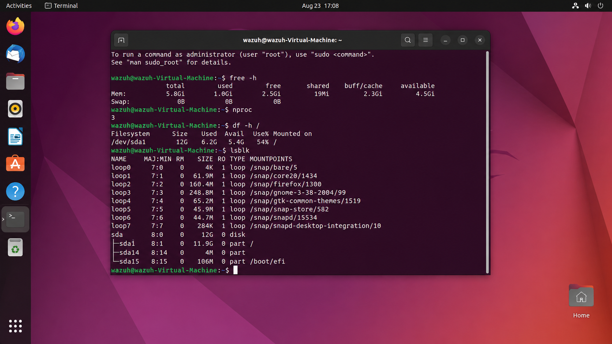
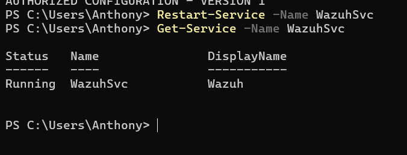
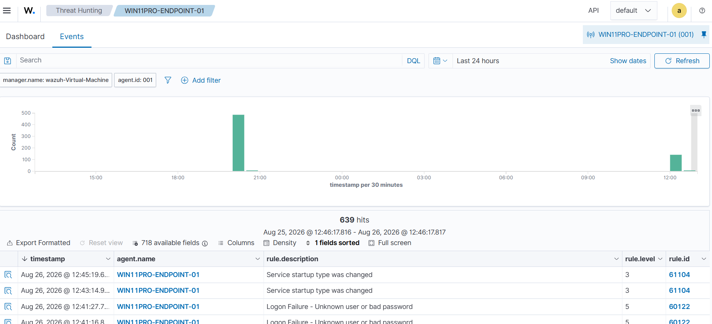
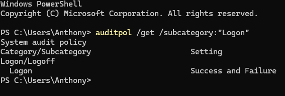

# Phase 1 — Wazuh SIEM Deployment & Windows Endpoint Monitoring

**Wazuh · Ubuntu 22.04 LTS · Windows 11 Pro · Hyper-V · PowerShell · Windows Security Auditing**

Lab period: August 2026

Archived before retirement of the Ubuntu/Wazuh virtual machine. This document preserves the project objective, architecture, implementation steps, commands/configuration, evidence, findings, and portfolio-ready wording.

Consolidated commands: [`../scripts/ubuntu-wazuh-server-commands.sh`](../scripts/ubuntu-wazuh-server-commands.sh) and [`../scripts/windows-endpoint-commands.ps1`](../scripts/windows-endpoint-commands.ps1).

---

## 1. Project Objective

Build a functional cybersecurity monitoring environment on a Windows 11 Pro host using Hyper-V, deploy an Ubuntu virtual machine as the Wazuh server, connect the Windows host as a monitored endpoint, and verify that Windows security telemetry reaches the Wazuh dashboard.

## 2. Architecture

| Component | Role |
|---|---|
| Windows 11 Pro host | Hyper-V host and monitored endpoint |
| Hyper-V | Virtualization platform |
| Ubuntu 22.04 LTS VM | Wazuh all-in-one server / manager environment |
| Wazuh Windows agent | Collected endpoint telemetry and sent it to the manager |
| Wazuh dashboard / Threat Hunting | Centralized alert review and investigation interface |

## 3. Pre-Deployment Validation and Storage Work

- Validated the Ubuntu VM before installation by checking memory, CPU, root-disk capacity, block-device layout, and network addressing.
- Initial validation showed approximately 5.8 GiB RAM, 3 CPU processing units, and a root filesystem of roughly 12 GiB. The root disk was too small for a comfortable all-in-one Wazuh deployment.
- Expanded the virtual disk and Ubuntu filesystem. Final verification showed approximately 59 GiB total storage, 51 GiB available, and about 14% utilization.
- Confirmed the Ubuntu VM's IP address for later dashboard access and Windows-agent communication.

```bash
free -h
nproc
df -h /
lsblk
hostname -I
hostname -I | awk '{print $1}'
```



## 4. Wazuh Server Installation and Validation

The Wazuh all-in-one environment was installed on the Ubuntu VM and brought to a working dashboard state. The exact installer command used during the earliest installation step was not preserved in the final command archive, so it is intentionally not reconstructed here. The preserved evidence confirms the deployed Ubuntu/Wazuh VM, dashboard access, manager operation, and later configuration work.

## 5. Windows Endpoint Deployment

From the Wazuh dashboard, a Windows MSI deployment command was generated. The agent was assigned the descriptive name `WIN11PRO-ENDPOINT-01` and pointed to the Wazuh manager at the lab IP address used at that time.

```powershell
Invoke-WebRequest -Uri https://packages.wazuh.com/4.x/windows/wazuh-agent-4.14.7-1.msi -OutFile $env:tmp\wazuh-agent
msiexec.exe /i $env:tmp\wazuh-agent /q WAZUH_MANAGER='172.30.227.145' WAZUH_AGENT_NAME='WIN11PRO-ENDPOINT-01'

Get-Service -Name WazuhSvc
Start-Service -Name WazuhSvc
Get-Service -Name WazuhSvc
```



## 6. Endpoint Connection Verification

- Verified the endpoint appeared in Wazuh as agent ID 001 with status Active.
- The dashboard identified the endpoint as Microsoft Windows 11 Pro and showed the installed Wazuh agent version.
- Used Threat Hunting / Events to confirm centralized ingestion of Windows security telemetry.



## 7. Windows Security Auditing

Logon auditing was checked to ensure both successful and failed authentication activity could be captured for later SOC-style investigations.

```powershell
auditpol /get /subcategory:"Logon"
```



## 8. Skills Demonstrated

- Hyper-V virtualization and VM administration
- Linux resource validation and storage troubleshooting
- Wazuh SIEM deployment and endpoint onboarding
- Windows service administration with PowerShell
- Windows Security auditing, centralized logging, and SIEM event investigation

## 9. Resume-Ready Version

- Built a virtualized cybersecurity monitoring lab in Hyper-V, deployed a Wazuh server on Ubuntu Linux, and validated CPU, memory, storage, networking, and service health before implementation.
- Installed and configured the Wazuh Windows agent on a Windows 11 Pro endpoint, connected it to the centralized manager, and verified active endpoint communication and security-event ingestion.
- Configured Windows Security auditing for logon activity and used Wazuh Threat Hunting to investigate endpoint telemetry, Windows Event IDs, rule severity, and event details.
- Used PowerShell and Linux administration commands to deploy, validate, restart, and troubleshoot Wazuh components across the Windows endpoint and Ubuntu server.

## 10. Portfolio Talking Points

- **Why the storage expansion mattered:** SIEM platforms retain logs and indexes; insufficient disk space can interrupt ingestion or prevent installation.
- **Why the agent matters:** the Wazuh agent converts the Windows endpoint into a telemetry source for centralized monitoring.
- **Why audit policy matters:** the SIEM can only analyze events that Windows is configured to generate and retain.
