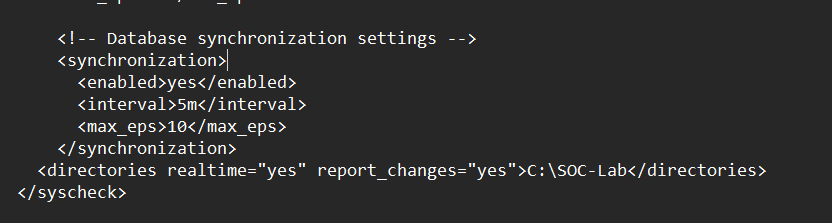
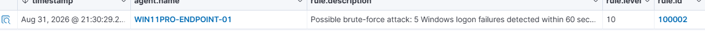
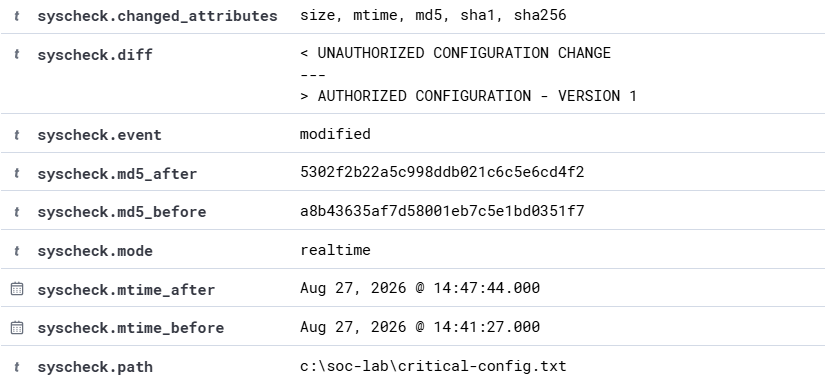
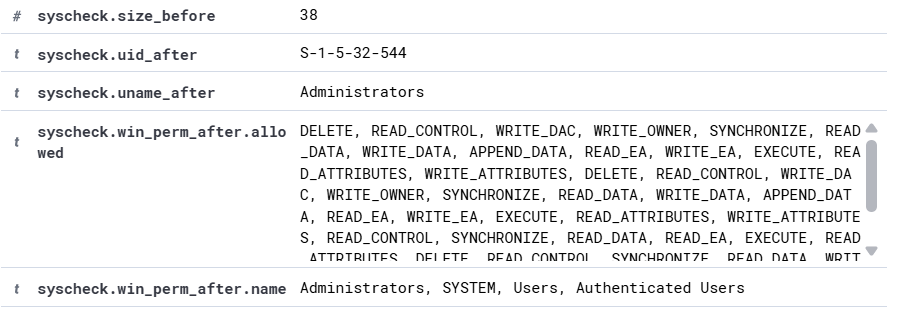

# Phase 2 — File Integrity Monitoring & Configuration Change Detection

**Wazuh FIM · Syscheck · Windows 11 Pro · PowerShell · Hashing · Change Detection**

Lab period: August 27, 2026

Archived before retirement of the Ubuntu/Wazuh virtual machine. This document preserves the project objective, architecture, implementation steps, commands/configuration, evidence, findings, explanations, cleanup/remediation, and portfolio-ready wording.

Consolidated commands: [`../scripts/windows-endpoint-commands.ps1`](../scripts/windows-endpoint-commands.ps1).

---

## 1. Project Objective

Configure Wazuh File Integrity Monitoring (FIM) to watch a controlled Windows directory in real time, simulate an unauthorized configuration change, investigate exactly what changed, restore the authorized state, and verify the remediation was also detected.

## 2. Baseline Artifact

```powershell
New-Item -Path "C:\SOC-Lab" -ItemType Directory -Force
Set-Content -Path "C:\SOC-Lab\critical-config.txt" -Value "AUTHORIZED CONFIGURATION - VERSION 1"
Get-Content "C:\SOC-Lab\critical-config.txt"
```

The dedicated `C:\SOC-Lab` directory isolated the test from normal system files. The text file represented a security-sensitive configuration artifact with a known-good baseline.

## 3. Wazuh FIM Configuration

The Wazuh Windows agent configuration was edited under the `syscheck` section so the SOC-Lab directory would be monitored in real time and file-content changes would be reported.

```xml
<directories realtime="yes" report_changes="yes">C:\SOC-Lab</directories>
```



After the configuration change, the Wazuh Windows service was restarted and confirmed running.

```powershell
Restart-Service -Name WazuhSvc
Get-Service -Name WazuhSvc
```

## 4. Simulated Unauthorized Change

```powershell
Set-Content -Path "C:\SOC-Lab\critical-config.txt" -Value "UNAUTHORIZED CONFIGURATION CHANGE"
Get-Content "C:\SOC-Lab\critical-config.txt"
```

This created a controlled integrity violation. Wazuh generated an **Integrity checksum changed** alert for the monitored file.

## 5. Detection and Investigation



- Observed Wazuh Rule 550 with description *Integrity checksum changed*.
- Confirmed `syscheck.event = modified` and `syscheck.mode = realtime`.
- Reviewed `syscheck.changed_attributes` showing changes to size, modification time, MD5, SHA1, and SHA256.
- Used `syscheck.diff` to compare the prior authorized value with the unauthorized replacement.
- Reviewed before/after hashes to demonstrate how integrity monitoring detects content changes even when the filename remains the same.



| Field | Value |
|---|---|
| `syscheck.changed_attributes` | size, mtime, md5, sha1, sha256 |
| `syscheck.event` | modified |
| `syscheck.mode` | realtime |
| `syscheck.path` | c:\soc-lab\critical-config.txt |
| `syscheck.md5_before` | a8b43635af7d58001eb7c5e1bd0351f7 |
| `syscheck.md5_after` | 5302f2b22a5c998ddb021c6c5e6cd4f2 |

## 6. Remediation and Validation

```powershell
Set-Content -Path "C:\SOC-Lab\critical-config.txt" -Value "AUTHORIZED CONFIGURATION - VERSION 1"
Get-Content "C:\SOC-Lab\critical-config.txt"
```

The file was restored to its authorized baseline. Wazuh generated another FIM event, proving the remediation itself was visible to the monitoring system.



## 7. Analyst Interpretation

- A file-integrity alert does not automatically prove malicious activity; the analyst must determine whether the change was authorized.
- The before/after diff is especially valuable because it explains the content change instead of only reporting that a hash changed.
- The workflow demonstrated detection, investigation, remediation, and validation rather than stopping at alert generation.

## 8. Resume-Ready Version

- Configured Wazuh Syscheck for real-time File Integrity Monitoring of a dedicated Windows SOC lab directory with change reporting enabled.
- Created a baseline configuration file and simulated an unauthorized modification to validate detection of changes to file size, modification time, and cryptographic hashes.
- Investigated Wazuh Rule 550 alerts and analyzed before-and-after file content through `syscheck.diff` to identify exactly what changed.
- Restored the authorized configuration and verified Wazuh detected the remediation, demonstrating a complete detect-investigate-remediate-validate workflow.

## 9. Key Artifacts to Preserve

- `C:\SOC-Lab\critical-config.txt` baseline concept
- Syscheck directory configuration entry
- Rule 550 event evidence
- `syscheck.diff` before/after evidence
- MD5, SHA1, and SHA256 before/after values
