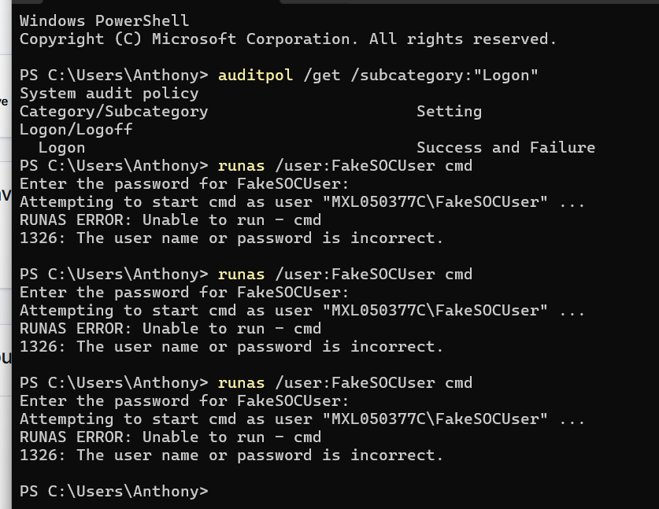
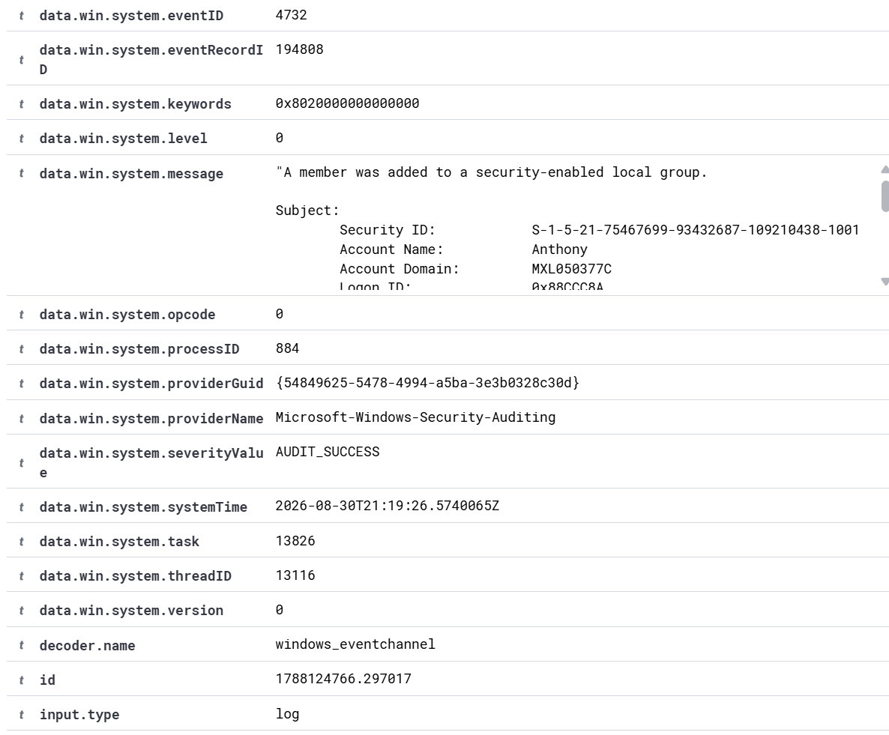
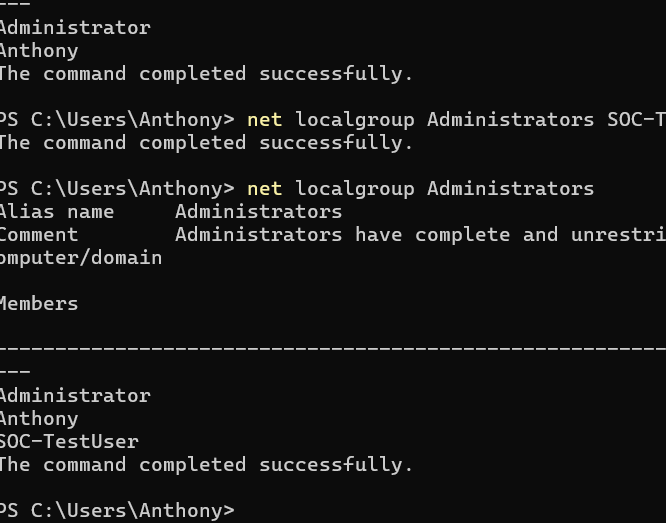
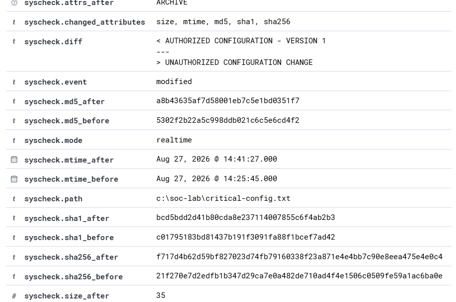
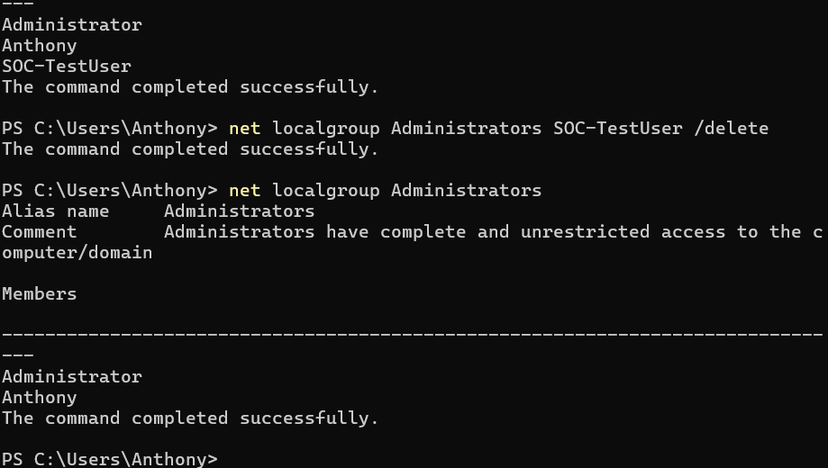
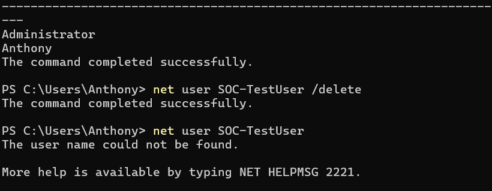
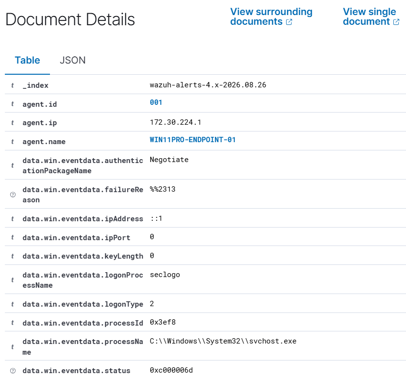

# Phase 3 — Windows Identity & Privileged Account Activity Monitoring

**Wazuh · Windows Security Auditing · IAM · PowerShell · Privileged Access Monitoring**

Lab period: August 30, 2026

Archived before retirement of the Ubuntu/Wazuh virtual machine. This document preserves the project objective, architecture, implementation steps, commands/configuration, evidence, findings, explanations, cleanup/remediation, and portfolio-ready wording.

Consolidated commands: [`../scripts/windows-endpoint-commands.ps1`](../scripts/windows-endpoint-commands.ps1).

---

## 1. Project Objective

Monitor the lifecycle of a controlled Windows local account and privileged-group membership changes in Wazuh. The project focused on IAM-relevant events: account creation, privilege assignment, privilege removal, and account deletion.

## 2. Enable Account-Management Auditing

```powershell
auditpol /set /subcategory:"User Account Management" /success:enable /failure:enable
auditpol /get /subcategory:"User Account Management"
```

Success and Failure auditing ensured Windows generated security events for account-management activity.

## 3. Create and Verify a Test Account

```powershell
net user SOC-TestUser "LabOnly!2026#" /add
net user SOC-TestUser
```



- Wazuh captured Windows Event ID 4720: *A user account was created*.
- The event identified the initiating subject account, target username `SOC-TestUser`, target SID, computer, Security channel, and audit-success status.
- Wazuh classified the activity with rule description *User account enabled or created* and Rule 60109, Level 8.



## 4. Simulate Privilege Escalation

```powershell
net localgroup Administrators SOC-TestUser /add
net localgroup Administrators
```



- Wazuh captured Windows Event ID 4732: *A member was added to a security-enabled local group*.
- The target group was Builtin\Administrators (SID S-1-5-32-544).
- Wazuh generated Rule 60154, *Administrators Group Changed*, at Level 12.
- The rule included MITRE ATT&CK T1484 and categorized the activity under Defense Evasion / Privilege Escalation, illustrating why privileged-group changes deserve higher severity.



## 5. Remove Privileged Access

```powershell
net localgroup Administrators SOC-TestUser /delete
net localgroup Administrators
```



- Wazuh captured Event ID 4733: *A member was removed from a security-enabled local group*.
- This demonstrated that de-escalation/removal of privilege is also auditable and should be retained as evidence in an IAM lifecycle.

## 6. Delete and Verify Account Cleanup

```powershell
net user SOC-TestUser /delete
net user SOC-TestUser
```



- Wazuh captured Event ID 4726: *A user account was deleted*.
- The event preserved the initiating account and target account information even after the local user no longer existed.
- The full sequence modeled provisioning, privileged-access assignment, de-provisioning of privilege, and final account removal.



## 7. IAM / SOC Interpretation

- Account creation should be validated against an approved provisioning request.
- Membership in Administrators represents a significant access change and should receive elevated scrutiny.
- Removal and deletion events support de-provisioning verification and access-review evidence.
- The initiating subject account is important for attribution: it answers *who* performed the change, not only *what* account changed.

## 8. Resume-Ready Version

- Enabled Success and Failure auditing for Windows User Account Management and validated collection of identity-related Security events in Wazuh.
- Created a controlled local test account and investigated Windows Event ID 4720 in Wazuh, including the initiating user, target account, SID, and audit result.
- Added the test account to the local Administrators group and detected the privileged membership change through Event ID 4732 and Wazuh Rule 60154, a Level 12 alert.
- Removed the account from the Administrators group and deleted it, validating Event IDs 4733 and 4726 and demonstrating monitoring across the account lifecycle and privileged-access changes.

## 9. Event Reference

| Event ID | Meaning |
|---|---|
| 4720 | User account created |
| 4732 | Member added to security-enabled local group |
| 4733 | Member removed from security-enabled local group |
| 4726 | User account deleted |
