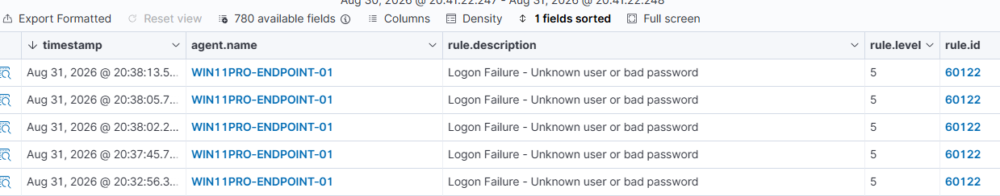
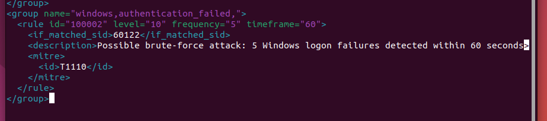
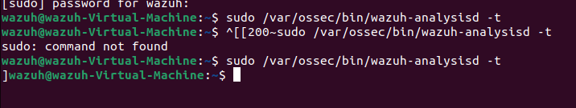
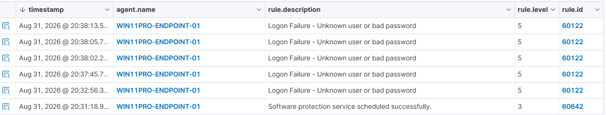
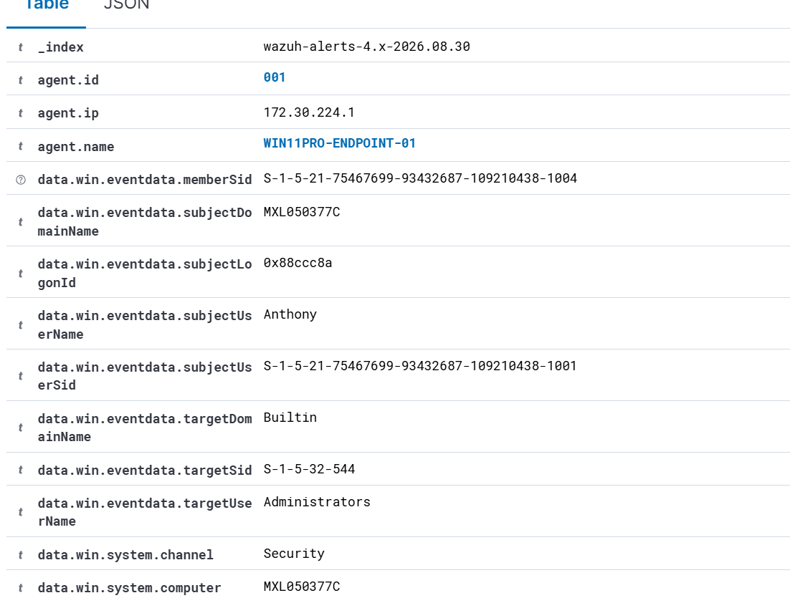

# Phase 4 — Custom Brute-Force Detection & SIEM Correlation

**Wazuh · Detection Engineering · Windows Event ID 4625 · Custom Rules · MITRE ATT&CK T1110**

Lab period: August 31 – September 1, 2026

Archived before retirement of the Ubuntu/Wazuh virtual machine. This document preserves the project objective, architecture, implementation steps, commands/configuration, evidence, findings, explanations, cleanup/remediation, and portfolio-ready wording.

Consolidated commands: [`../scripts/ubuntu-wazuh-server-commands.sh`](../scripts/ubuntu-wazuh-server-commands.sh), [`../scripts/windows-endpoint-commands.ps1`](../scripts/windows-endpoint-commands.ps1), custom rule: [`../scripts/wazuh-custom-rules.xml`](../scripts/wazuh-custom-rules.xml).

---

## 1. Project Objective

Move beyond reviewing individual failed logons by creating a custom Wazuh correlation rule that detects a repeated authentication pattern: five Windows logon failures within 60 seconds.

## 2. Verify Logon Auditing

```powershell
auditpol /get /subcategory:"Logon"
```

Windows was already configured to audit both successful and failed logon activity.

## 3. Generate Controlled Failed Logons

```powershell
runas /user:FakeSOCUser cmd
```

The nonexistent/test username `FakeSOCUser` was used to intentionally generate failed authentication attempts. The resulting RUNAS error 1326 indicated an incorrect username or password. Repeating the test generated multiple Windows Security Event ID 4625 records.



## 4. Investigate the Base Event

- Windows Event ID 4625 - *An account failed to log on*.
- Target username: `FakeSOCUser`.
- Wazuh base rule: 60122.
- Base severity: Level 5.
- Observed authentication context included Logon Type 2, Security channel, endpoint/computer name, failure status/substatus, and the initiating subject.

The key detection-engineering observation was that each failed logon was visible, but the individual alerts did not by themselves express the higher-risk pattern of repeated failures.

## 5. Create a Custom Correlation Rule

```bash
sudo nano /var/ossec/etc/rules/local_rules.xml
```

```xml
<group name="windows,authentication_failed,">
<rule id="100002" level="10" frequency="5" timeframe="60">
<if_matched_sid>60122</if_matched_sid>
<description>Possible brute-force attack: 5 Windows logon failures detected within 60 seconds</description>
<mitre>
<id>T1110</id>
</mitre>
</rule>
</group>
```



## 6. Validate and Load the Rule

```bash
sudo /var/ossec/bin/wazuh-analysisd -t
sudo systemctl restart wazuh-manager
sudo systemctl status wazuh-manager --no-pager
```



The validation command returned without a configuration error. The Wazuh manager was restarted so the custom rule would become active.

## 7. Trigger the Correlated Detection

- Generated at least five controlled failed logons inside the 60-second correlation window.
- Wazuh matched the repeated Rule 60122 events and fired custom Rule 100002.
- The new alert was Level 10 and described a possible brute-force attack.
- The custom rule mapped the activity to MITRE ATT&CK T1110 - Brute Force.





## 8. SOC Triage and Disposition

- **Detection result:** true positive for the defined behavior — five failed logons occurred within the threshold.
- **Incident disposition:** authorized lab simulation, not an actual compromise.
- **Analyst reasoning:** the event timing, known test username, endpoint, and intentional test activity explained the alert.
- This distinction demonstrates an important SOC concept: a technically correct detection can still be benign/authorized after investigation.

## 9. Detection Logic Explained

- **`if_matched_sid` 60122:** use Wazuh's existing failed-logon detection as the building block.
- **`frequency` 5:** require five matching events.
- **`timeframe` 60:** require those matches within 60 seconds.
- **`level` 10:** escalate the correlated behavior above the Level 5 individual failures.
- **MITRE T1110:** attach a recognized adversary-technique classification to the detection.

## 10. Resume-Ready Version

- Generated controlled failed Windows authentication attempts and investigated Event ID 4625 telemetry in Wazuh, including the targeted account, audit status, endpoint, and authentication context.
- Identified that individual failed logons triggered Wazuh Rule 60122 at Level 5 but were not automatically escalated as a repeated-authentication pattern.
- Developed and validated custom Wazuh Rule 100002 to correlate five Rule 60122 authentication failures within 60 seconds and generate a Level 10 brute-force alert.
- Mapped the custom detection to MITRE ATT&CK T1110 (Brute Force), restarted and validated the Wazuh ruleset, then successfully triggered and investigated the correlated alert.
- Performed SOC-style alert triage and classified the resulting detection as a true-positive authorized test based on known lab activity.

## 11. LinkedIn-Ready Version

Built and tested a custom brute-force detection workflow in a cybersecurity home lab using Wazuh SIEM and Windows Security telemetry. Generated controlled Event ID 4625 authentication failures, analyzed Wazuh Rule 60122 alerts, and developed custom Rule 100002 to correlate five failed logons within 60 seconds. Validated the XML ruleset, restarted the Wazuh manager, successfully triggered a Level 10 correlated alert, mapped the detection to MITRE ATT&CK T1110, and performed SOC-style triage to classify the activity as an authorized true-positive simulation.
